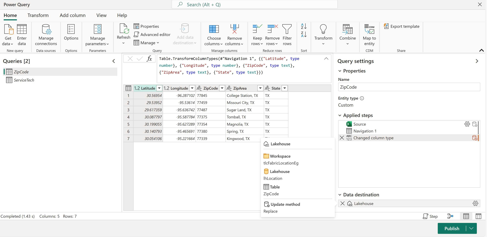

## Summary
In Power BI, it is sometimes useful to use the physical distance between entities.  For example, a report may show a list of open service jobs that need to be assigned to a technician.  In addition to filtering on skill sets, availability, and other criteria, it may be necessary to look only for service technicians whose current location is within a certain threshold (e.g., < 50 miles) to the service job location.

By pre-calculating the distance (between entities), and then relating this information (in the Power BI dataset), it is possible to efficiently use the distance calculations.

For example, as shown in the screenshot below, we can select a service area (either in the slicer, or directly in the map); after an area is selected, the table shows all technicians who are within a certain distance threshold.   Note that during the pre-calculation process, any distances beyond 50 miles were excluded.  But, in the report, we can further shrink the max distance (using a slicer).

Note: A version of the report in this repo is available to view online [here](https://app.powerbi.com/view?r=eyJrIjoiMDQxZjUwMjgtOTA0ZC00ZjdmLTk1YzEtMDVlM2RmNWViMTczIiwidCI6IjRmY2YxMGM2LWVjODEtNDhkYy1iNzZjLTJjM2Q2MDAxN2M1YSIsImMiOjZ9)

To recreate this solution in your environment:
* Provision a Power BI Workspace - and assign the workspace to a capacity with Fabric capabilities.
* Create a Lakehouse in the workspace.
* Create a Dataflow Gen2 to load the two tables in the Excel workbook (LocationEgV2.xlsx) to Lakehouse Delta Tables (see screenshot below).  Tip: In Dataflow Gen2, you can upload an Excel file while defining the flow.
* Use the included notebook in this repo to generate the 3rd Delta Table (i.e. ServiceTechLocationDistance) to store the distance calculations.
* Open the sample notebook in this repo (LocationEg_V2.pbix); modify the Parameters DBServer and DBName to match your lakehouse SQL Connection properties, and then click the Refresh button.
* Optional - deploy LocationEg_V2.pbix to the workspace.

