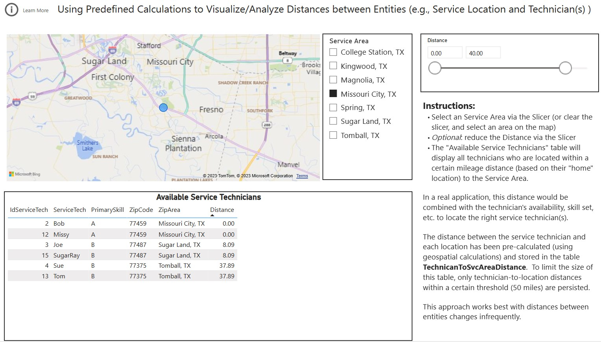

## Summary
In Power BI, it is sometimes useful to use the physical distance between entities.  For example, a report may show a list of open service jobs that need to be assigned to a technician.  In addition to filtering on skill sets, availability, and other criteria, it may be necessary to look only for service technicians whose current location is within a certain threshold (e.g., < 50 miles) to the service job location.

By pre-calculating the distance (between entities), and then relating this information (in the Power BI dataset), it is possible to efficiently use the distance calculations.

TODO.....

Note: A version of the report in this repo is available to view online [here](https://app.powerbi.com/view?r=eyJrIjoiMDQxZjUwMjgtOTA0ZC00ZjdmLTk1YzEtMDVlM2RmNWViMTczIiwidCI6IjRmY2YxMGM2LWVjODEtNDhkYy1iNzZjLTJjM2Q2MDAxN2M1YSIsImMiOjZ9)

